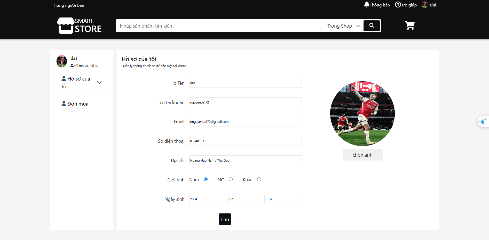

# Smart Store

## Description

This is a Smart Store project that provides a client-side response. The project includes features such as:

-   Register as a buyer or seller
-   Payment through various.
-   Search functionality
-   User management
-   Products management
-   Orders management
-   Reviews and comments
-   Detail product

---

## SPACE FOR USERS / CUSTOMERS

### Home Page


### Login

-   Login
    

### Register

-   Register
    

### Search Page

-   Search
    

-   Search Result
    

### Product Detail Page

-   Detail
    

### Add To Cart

-   Add to cart
    

-   Cart Result
    

### Shop Detail Page


### Payment

-   Payment
    

-   Payment Success
    

## SPACE FOR VENDORS

### Manage Products


### Create Product

-   Create Product
    
-   Create Success
    

### Update Product

-   Update
    

-   Update Success
    

### Delete Product


## Installation:

1. **Install Composer**:  
   Download Composer from [here](https://getcomposer.org/download).

2. **Install XAMPP**:  
   Download XAMPP from [here](https://www.apachefriends.org/download.html).

## Usage Server Repository:

1. **Clone the server repository**:

```bash
  git clone https://github.com/Minhhiep222/SMART_STORE.git
```

2. **run "composer install" in terminal or cmd, git bash**

```bash
composer install
```

3. **run "php artisan key:generate" in terminal or cmd, git bash**

```bash
php artisan key:generate
```

4. **Phpmyadmin create a table database**

5. **In file .env look for line 14: DB_DATABASE="your-name-database"**

6. **run "php artisan migrate --seed" in terminal or cmd, git bash for database and data**

```bash
php artisan migrate --seed
```

7. **run "php artisan serve" for run sever**

```bash
php artisan serve
```
